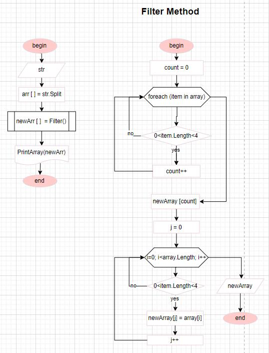

# __Final work of 1st semester of Ina Biarnatskaya__

## __Block Diagram__

***

## __Solution__

1. Inputting a string from the keyboard
2. Putting the elements of a string into an array separated by a space plus removing empty elements
3. Adding of method of filterring array with item's length >= 3
* Count length of filtered array
* Putting the filtered elements into a new array (with array length = count)
4. Adding of method of new array printing

***